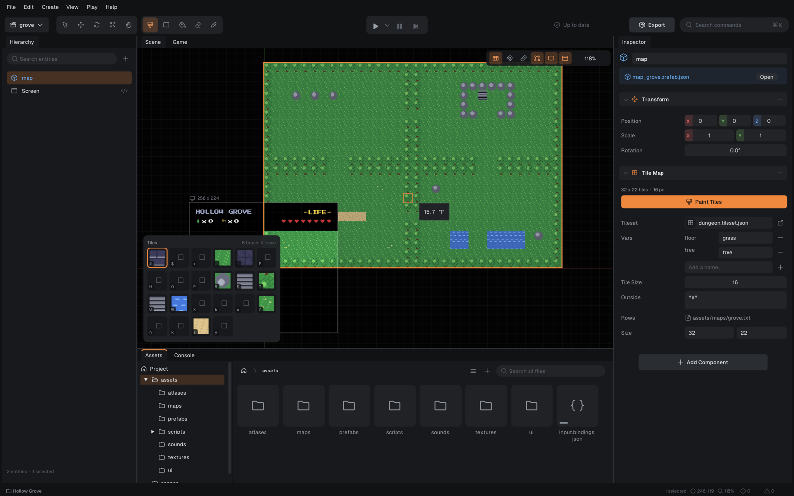

# Journeyman Game Engine

A small, modular 2D game engine written in C++ with games scripted in
AssemblyScript (compiled to WebAssembly) and a Go CLI (`jm`) that works like a
headless editor: scaffold, build, run, pack, and export standalone games.

This engine is for educational purposes and not meant to be a _real_ game
engine. I hope you like it, and I hope you can learn something from it!

**Website:** [jumballaya.github.io/Journeyman-Engine](https://jumballaya.github.io/Journeyman-Engine/):
getting started, building games with an AI agent, the demo games and the docs.
Its source is in [site/](site/).

The repo ships a complete demo game, **Strike Wing 1942** (`demos/strike_wing/`): a
1942-style vertical shooter with a title menu, two stages and a boss fight,
pause menu, results screens between stages, game over and victory screens,
saved high score and options. See [demos/strike_wing/README.md](demos/strike_wing/README.md).

## The editor

`journeyman_editor` is a desktop editor for Journeyman projects: scenes in a
live viewport with gizmos, a schema-driven inspector, tile-map painting,
prefabs, an asset browser, play-in-editor, a command palette, and one-click
export of a standalone game. See [docs/editor.md](docs/editor.md).



```bash
./scripts/build-release.sh                       # engine + editor
(cd cli && go build -o ../build/bin/jm ./cmd/jm) # the CLI the editor drives
./build/release/editor/journeyman_editor
./scripts/package-editor.sh                      # dist/Journeyman Editor.app (jm + engine inside)
./scripts/install_mac.sh                         # build and install in /Applications (macOS)
```

## Play the demo

```bash
./scripts/play-demo.sh            # build everything and run in a window
./scripts/play-demo.sh --export   # build a standalone app in demos/strike_wing/dist/
```

Controls: arrows/WASD move, Space/Z fire, X bomb, Esc/P pause, F11 fullscreen.
Gamepads work too (stick/D-pad, A fire, B bomb, Start pause).

## Install

Download a build from [Releases](https://github.com/Jumballaya/Journeyman-Engine/releases):
`journeyman-cli-<platform>` is `jm` and the engine, for the command line, CI
and AI agents; `journeyman-editor-<platform>` is the editor with both inside.
The newest are always at
`https://github.com/Jumballaya/Journeyman-Engine/releases/latest/download/journeyman-cli-<platform>.tar.gz`
(`darwin-arm64`, `darwin-amd64`, `linux-amd64`; `windows-amd64` is a `.zip`).
To install the CLI on macOS or Linux:

```sh
curl -fsSL https://github.com/Jumballaya/Journeyman-Engine/releases/latest/download/install.sh | sh
```

Each release's notes say how to install it (and, on macOS, how to get past
Gatekeeper: the builds aren't notarized).

To build from source instead:

## Requirements

- CMake ≥ 3.25 and Ninja (dependencies are fetched by CMake)
- A C++23 compiler (Apple Clang 15+, GCC 13+, MSVC 17.8+)
- Go 1.24+ for the `jm` CLI
- Node.js ≥ 20 for the engine's own JS tests (making a game doesn't need it: `jm build` downloads a pinned Node and AssemblyScript on first use)
- OpenGL 4.1 (macOS 11+, Linux, Windows). The GL loader is checked in (`vendor/glad`), so no Python is needed

With CMake ≥ 4.0 the presets already set `CMAKE_POLICY_VERSION_MINIMUM=3.5`
(some wasm3 packages require it).

## Build

```bash
./scripts/build-release.sh    # engine, server, editor and jm; jm + engine + server in build/bin
./scripts/build-debug.sh      # engine with trace logging → build/debug/...
./scripts/build-tests.sh      # C++ unit tests (ctest) + CLI tests (go test)

export PATH="$PWD/build/bin:$PATH"  # jm finds the engine and server beside it
```

C++ style is in `.clang-format`; format what you change with `git clang-format`
(the codebase isn't mass-formatted, so a whole-file format would churn it).

## Making a game

```bash
mkdir my-game && cd my-game
jm init "My Game"                  # .jm.json, scenes/main.scene.json, scripts folder, AGENTS.md

jm generate script player          # assets/scripts/player.ts; ships once a scene or prefab attaches it
jm generate prefab bullet          # assets/prefabs/bullet.prefab.json
jm generate ui hud                 # assets/ui/hud.ui.html
jm generate shader crt             # assets/shaders/crt.frag
jm generate bindings input         # assets/input.bindings.json
jm generate scene level2
jm generate list                   # everything generate can make

jm docs [topic]                    # the guides (scripting API, formats, testing), built into jm
jm doctor [--json] [--fetch]       # versions, script toolchain, project; what's wrong and how to fix it
jm build                           # compile scripts, bake atlases → build/ (--json: problems as JSON lines)
jm test                            # run tests/*.spec.ts (game logic, no build needed)
jm schema [Component]              # every component's scene keys and script fields, as JSON
jm golden [--update]               # compare frames with tests/golden images (record them with --update)
jm mcp                             # this CLI as an MCP server on stdio, for agents
jm fmt [--check]                   # the project's JSON in the layout the editor writes
jm run                             # play build/ (recorded in .jm/plays; F8 marks a moment)
jm plays [show|frame|state|drive|resume|verify]  # your plays, for your agent to see what you saw
jm pack                            # one archive: build/<name>.jm
jm run build/my-game.jm            # run the archive
jm export                          # standalone game: dist/<Name>.app (macOS) or dist/<Name>/
jm migrate                         # convert an older project (.script.json) to .ts scripts
```

A game doesn't say where the engine is: `jm` uses `$JM_ENGINE` if set, else
the `journeyman_engine` beside it (a release, or `build/bin` from
`scripts/build-release.sh`), else the one on `PATH`. The dedicated server is
found the same way (`$JM_SERVER`, else beside the engine). `jm doctor` shows
which one it found.

The project tree holds only sources you author: `.jm.json`, scenes, prefabs,
`.ts` scripts, images, sounds, fonts, `.ui.html`/`.css` screens, `.frag`
shaders, atlas configs and input bindings. `jm build` produces everything
else in `build/` (CLI-owned and wiped on every build).

### Agents

Everything an agent needs is a command or a file: it edits the project's files
and builds, tests and plays with `jm`. `jm init` writes an `AGENTS.md` (and a
`CLAUDE.md` that points to it) with the loop, the gotchas and where to look
things up; [docs/agents.md](docs/agents.md) is its template. The guides are
built into `jm` (`jm docs scripting`), so a machine with only the CLI has
them. For tools that speak the Model Context Protocol, `jm mcp` serves the
same commands over stdio (build, test, golden, schema, generate, doctor, and
drive_start/drive/drive_stop to play the built game a step at a time), with
the project's files, `jm://schema` and the guides (`jm://docs/<topic>`) as
resources. Register it as the command `jm mcp`, run in the project folder; for
Claude Code: `claude mcp add journeyman -- jm mcp`. It wraps the CLI rather
than adding to it: anything it does, `jm` does too. Headless runs, state
dumps, the stepped driver and machine-readable errors are in
[docs/testing.md](docs/testing.md).

### Exported games

`jm export` builds the game, packs it into one archive and appends that to a
copy of the engine: the result is a single executable with everything inside
(`dist/<Name>.app` on macOS, `--bare` for the binary alone; `dist/<Name>`
on Linux; `dist/<Name>.exe` on Windows). The engine finds the archive inside
itself through a footer, which survives code signing; macOS exports are
signed ad hoc and pass `codesign --strict`. `--target os-arch` exports for
another platform using that platform's engine build (the `players` CI
workflow builds them). A double-clicked game logs to and saves in the
per-user data directory (macOS: `~/Library/Application Support/<Name>/`).
Set `config.export.icon` (a PNG) for a macOS app icon. `jm export --server`
does the same with `journeyman_server`, for a multiplayer game's dedicated
server.

## Documentation

- [Scripting API](docs/scripting.md) — everything `@jm/runtime` exposes to
  game scripts: entities, spawning, components, input actions, audio, UI,
  scenes & transitions, post-effects, camera, time & pause, game state & saves.
- [Content & data formats](docs/content.md) — `.jm.json` config, scenes,
  prefabs, all built-in components, atlases & animation, the HTML/CSS UI
  subset, shaders, input bindings, audio.
- [Editor](docs/editor.md) — the workspace, scene editing, tile painting,
  play-in-editor, export, shortcuts and automation.
- [Testing & automation](docs/testing.md) — script tests, headless runs,
  input replay, frame capture.
- [Agents](docs/agents.md) — the AGENTS.md `jm init` writes: the loop for coding agents.
- [Plays](docs/plays.md) — you play, your agent sees it: recorded plays, markers, `jm plays`, and Codex, Claude Code and ChatGPT.
- [Developing the engine](docs/development.md) — the engine's own tests and CI checks.
- [Multiplayer](docs/networking.md) — sessions (client/server and peer to
  peer), shared entities, dedicated servers built from the same game,
  matchmaking, and running sessions on one machine.

## Project structure

The project is split into 2 parts: the cli and the engine. I wrote the CLI in Go because the language is simple and easy to read and follow, it has a rich standard (and extended standard) library including tools for manipulating images, language-first JSON marshalling and a whole lot more that the helped me write the cli faster.

The CLI entry is in `cli/cmd/jm/main.go` and each of the top-level commands are in the other `.go` files in the same folder. The CLI is built and installed using the `go` command and has nothing to do with the cmake files. The AssemblyScript runtime (`@jm/runtime`) lives in `cli/internal/stdlib/runtime/`; it is embedded in the `jm` binary and extracted into each project's `node_modules` on build.

The engine was written in C++ and uses cmake to build. The main goal of the engine is to create a modular system built around the core module. The modules are split into the core module and feature modules, where features can be optional based on the build: `journeyman_server`, the dedicated multiplayer server, is the same engine linked without the window, renderer, UI and audio modules.

#### The core module contains:
- `app`: the runtime — `Application` (process shell, argv, logging, standalone archive discovery), `Engine` (frame loop, manifest, `GameClock`, `GameState` stores, `EntitySpawner`), `SceneManager` (scene lifecycle and shader transitions), `EngineModule`, `ModuleRegistry` and the `REGISTER_MODULE` macro.
- `assets`: asset management and filesystem abstraction — `AssetManager`, `FileSystem`, and the `.jm` `Archive` reader. Feature modules register converters per extension (folder mode) and per type (archive mode).
- `async`: `LockFreeQueue`, the bounded MPMC queue behind the event bus and the audio thread's commands.
- `ecs`: archetype-based ECS — CRTP `Component`s, `System`s run one at a time on the main thread in a fixed order (stage, then declared dependencies, then registration; see `SystemTraits.hpp`), JSON prefabs with deep-merged overrides, tags, deferred destruction.
- `events`: pub/sub `EventBus` with a lock-free queue drained on the main thread.
- `logger`: macro-wrapped `spdlog` calls — `JM_LOG_XXX("...{}", x)`.
- `scripting`: WASM scripting backed by `wasm3` — `ScriptManager`, `ScriptComponent` and the host-function plumbing. Scripting is core, not a feature module: every game needs it.

#### Feature modules:
- `audio`: miniaudio device + mixer. All voice state lives on the audio thread and is driven by a lock-free command queue; master/music/sfx buses, sample-accurate fades, voice stealing, soft limiter. `.wav`/`.ogg`/`.mp3`/`.flac`.
- `glfw_window`: the window, fullscreen toggling, headless mode for automation.
- `inputs`: keyboard state (modifiers included), gamepads (GLFW gamepad mappings, in `devices/`), named actions from `.bindings.json`, auto-repeat, input replay, and remote players' input.
- `net`: multiplayer over ENet: client/server and peer-to-peer sessions, shared entities (`NetworkComponent`), the `Net` script API. See [docs/networking.md](docs/networking.md).
- `physics2d`: transforms, velocities and accelerations, AABB colliders with layer masks (calls `onCollide` on scripts), lifetimes, scroll-wrapping.
- `tilemap`: ASCII tile maps over JSON tilesets (edge-aware auto-tiling, animated tiles, tags), drawn per view without per-tile entities; scripts query them and move boxes through them. Drawing them is `tilemap/render`'s.
- `renderer2d`: z-sorted instanced sprite batching at a fixed logical resolution (letterboxed, DPI-independent), texture atlases and sprite animation, a screen-space UI pass, post-effect chain with builtin and custom `.frag` shaders, shader-composited scene transitions, camera shake, frame capture.
- `ui`: HTML/CSS screens (`.ui.html`) — parser, cascade, flexbox-subset layout, TrueType text rendered through glyph atlases — and world-space text (`TextComponent`).

## EngineModule structure

### Base methods

- `registerComponents`: `void registerComponents(Engine& app)` -- Registers the module's components (below) and nothing else. Runs before any module initializes, and on its own for `journeyman_engine --schema`: no window, GL context or project.
- `bindScriptApi`: `void bindScriptApi(Engine& app)` -- Binds the module's script host functions (below) and nothing else; runs after `registerComponents`, also for `--schema`. The lambdas may capture `this` and read state `initialize` sets up later.
- `initialize`: `void initialize(Engine& app)` -- This initializes your module, the constructor should be default constructable and you must do all of your initialization here in this method. The `app` param can be used to access the asset manager, ecs, scripting and events.
- `shutdown`: `void shutdown(Engine& app)` -- This is where you would shutdown any owned resources if needed as well as unsub from any events.
- `tickMainThread`: `void tickMainThread(Engine&, float dt)` -- This method runs each frame after the systems. This is where the window polls input, the renderer draws, etc.

A frame is single-threaded and runs in the same order every time: systems
(scripts first), then the queued spawns and destroys, then each module's
`tickMainThread`, then the scene manager and events. Only the audio callback
runs on another thread.

Modules declare dependencies with `ModuleTraits<T>` (`Provides`/`DependsOn`
tag lists from `ModuleTags.hpp`); each `Engine` builds its own
`ModuleRegistry` from the `REGISTER_MODULE` catalog and initializes them in
dependency order. A module can reach another via
`app.getModules().find<OtherModule>()` once it depends on its tag.

### Initialization

- Register systems: `app.getWorld().registerSystem<AudioSystem>(_audio);`. Give each a `SystemTraits` specialization (reads/writes/stage) so the scheduler knows what it may run alongside; undeclared systems run exclusively.
- Register components (in `registerComponents`) with a `ComponentSpec` (every member optional): how to read scene/prefab JSON, which fields scripts may touch, what to release when an entity dies, and a schema describing the JSON for the editor's inspector:
```cpp
app.getWorld().registerComponent<HealthComponent>({
    .fromJson = [](HealthComponent& c, const nlohmann::json& json, EntityId) {
      c.hp = json.value("hp", 3.0f);
    },
    .scriptFields = {scriptField<HealthComponent>("hp", [](HealthComponent& c) -> float& { return c.hp; })},
    .onDestroy = [this](HealthComponent& c) { /* free external resources */ },
    .schema = {"Health", "Gameplay", "Hit points; 0 destroys the entity",
               {FieldSchema::number("hp", 3, "Starting hit points", 0, 100, 1)}},
});
```
  Scripts then use `new Field("HealthComponent", "hp")` (script fields are 4-byte `float`s or `uint32_t`s).
- Expose functions to scripts (in `bindScriptApi`) by binding ordinary lambdas; the wasm signature and argument decoding come from the C++ types (`std::string`, `EntityId`, numbers, `bool`, `ScriptCall&` for the calling script; see `scripting/HostBinding.hpp`):
```cpp
app.getScriptManager().bind("__jmSoundPlay", [this](std::string name, float gain, bool loop, int32_t bus) {
  return _audio.play(AudioHandle(name), gain, loop, bus == 1 ? AudioBus::Music : AudioBus::Sfx);
});
```
  Declare the import in the runtime (`cli/internal/stdlib/runtime/env.ts`) and wrap it in a friendly API there; `scripts/check-host-api.mjs` (a CTest) fails if a declaration's name or signature doesn't match a binding. Bad script pointers and C++ exceptions trap only the calling script.
- Host functions run on the main thread during the script system's update: they may read and write components and call OpenGL, but structural changes (spawn/destroy) go through `EntitySpawner` / `World::destroyDeferred`, since systems may be iterating the world.
- Set up custom asset loading (register both the extension and the archive type):
```cpp
  auto decoder = [this](const RawAsset& asset, const AssetHandle& handle) {
    _audio.insert(handle, decode(asset.data));
  };
  app.getAssetManager().addAssetConverter({".wav"}, decoder);   // folder mode
  app.getAssetManager().addAssetTypeConverter("audio", decoder); // archive mode
```

## License

MIT; see [LICENSE](LICENSE). The bundled fonts carry their own OFL licenses.
